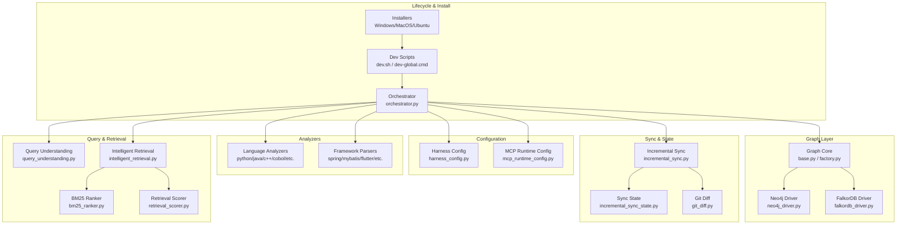
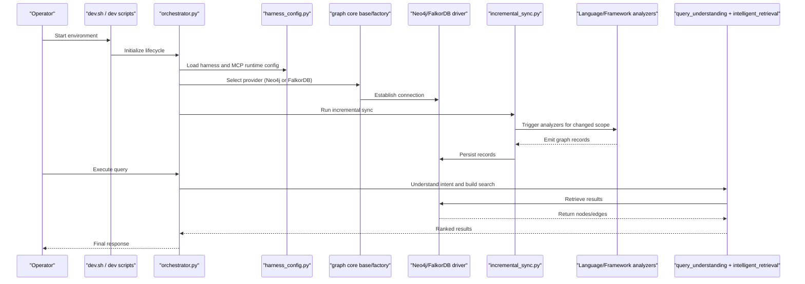
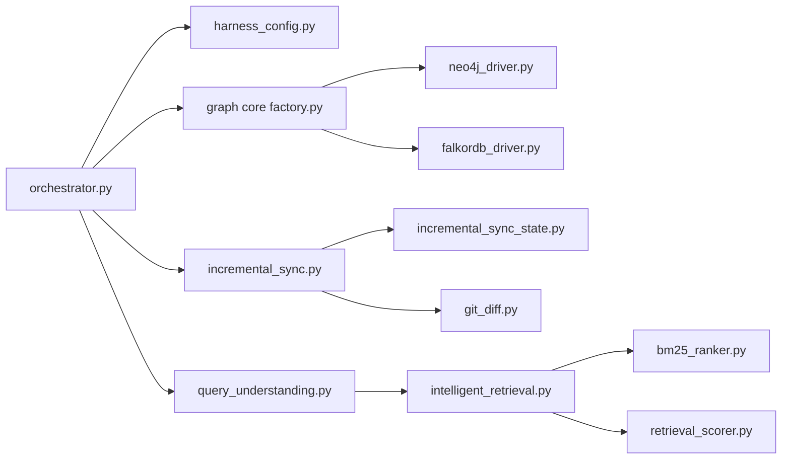

# Troubleshooting & FAQ

<cite>
**Referenced Files in This Document**
- [ReadMe.md](file://ReadMe.md)
- [Makefile](file://Makefile)
- [dev.sh](file://dev.sh)
- [install-windows.bat](file://install-windows.bat)
- [install-windows.ps1](file://install-windows.ps1)
- [INSTALLER_GUIDE.md](file://INSTALLER_GUIDE.md)
- [harness/scripts/orchestrator.py](file://harness/scripts/orchestrator.py)
- [harness/scripts/verify.sh](file://harness/scripts/verify.sh)
- [cortex_harness/dev.py](file://cortex_harness/dev.py)
- [code-tiny/tools/common/harness_config.py](file://code-tiny/tools/common/harness_config.py)
- [code-tiny/tools/graph/driver/neo4j_driver.py](file://code-tiny/tools/graph/driver/neo4j_driver.py)
- [code-tiny/tools/graph/driver/falkordb_driver.py](file://code-tiny/tools/graph/driver/falkordb_driver.py)
- [code-tiny/tools/common/incremental_sync_state.py](file://code-tiny/tools/common/incremental_sync_state.py)
- [code-tiny/tools/sync/incremental_sync.py](file://code-tiny/tools/sync/incremental_sync.py)
- [code-tiny/tools/common/analyzer_cache.py](file://code-tiny/tools/common/analyzer_cache.py)
- [code-tiny/tools/common/source_inventory.py](file://code-tiny/tools/common/source_inventory.py)
- [code-tiny/tools/common/graph_expander.py](file://code-tiny/tools/common/graph_expander.py)
- [code-tiny/tools/common/query_understanding.py](file://code-tiny/tools/common/query_understanding.py)
- [code-tiny/tools/common/intelligent_retrieval.py](file://code-tiny/tools/common/intelligent_retrieval.py)
- [code-tiny/tools/common/bm25_ranker.py](file://code-tiny/tools/common/bm25_ranker.py)
- [code-tiny/tools/common/retrieval_scorer.py](file://code-tiny/tools/common/retrieval_scorer.py)
- [code-tiny/tools/common/api_match_engine.py](file://code-tiny/tools/common/api_match_engine.py)
- [code-tiny/tools/common/call_graph_builder.py](file://code-tiny/tools/common/call_graph_builder.py)
- [code-tiny/tools/common/message_scan.py](file://code-tiny/tools/common/message_scan.py)
- [code-tiny/tools/common/git_diff.py](file://code-tiny/tools/common/git_diff.py)
- [code-tiny/tools/common/incremental_cleanup.py](file://code-tiny/tools/common/incremental_cleanup.py)
- [code-tiny/tools/common/url_normalizer.py](file://code-tiny/tools/common/url_normalizer.py)
- [code-tiny/tools/common/workflow_classifier.py](file://code-tiny/tools/common/workflow_classifier.py)
- [code-tiny/tools/common/workflow_impact_scorer.py](file://code-tiny/tools/common/workflow_impact_scorer.py)
- [code-tiny/tools/common/confidence_scorer.py](file://code-tiny/tools/common/confidence_scorer.py)
- [code-tiny/tools/common/signal_normalizer.py](file://code-tiny/tools/common/signal_normalizer.py)
- [code-tiny/tools/common/result_packager.py](file://code-tiny/tools/common/result_packager.py)
- [code-tiny/tools/common/semantic_inference.py](file://code-tiny/tools/common/semantic_inference.py)
- [code-tiny/tools/common/react_role_classifier.py](file://code-tiny/tools/common/react_role_classifier.py)
- [code-tiny/tools/common/frontend_relationship_extractor.py](file://code-tiny/tools/common/frontend_relationship_extractor.py)
- [code-tiny/tools/common/primary_vector_sync.py](file://code-tiny/tools/common/primary_vector_sync.py)
- [code-tiny/tools/common/query_intent_classifier.py](file://code-tiny/tools/common/query_intent_classifier.py)
- [code-tiny/tools/common/llm_summary.py](file://code-tiny/tools/common/llm_summary.py)
- [code-tiny/tools/database_schema/pipeline.py](file://code-tiny/tools/database_schema/pipeline.py)
- [code-tiny/tools/database_schema/database_schema_analyzer.py](file://code-tiny/tools/database_schema/database_schema_analyzer.py)
- [code-tiny/tools/mybatis/pipeline.py](file://code-tiny/tools/mybatis/pipeline.py)
- [code-tiny/tools/mybatis/mybatis_analyzer.py](file://code-tiny/tools/mybatis/mybatis_analyzer.py)
- [code-tiny/tools/spring/pipeline.py](file://code-tiny/tools/spring/pipeline.py)
- [code-tiny/tools/spring/spring_analyzer.py](file://code-tiny/tools/spring/spring_analyzer.py)
- [code-tiny/tools/flutter/pipeline.py](file://code-tiny/tools/flutter/pipeline.py)
- [code-tiny/tools/flutter/flutter_analyzer.py](file://code-tiny/tools/flutter/flutter_analyzer.py)
- [code-tiny/tools/perl/pipeline.py](file://code-tiny/tools/perl/pipeline.py)
- [code-tiny/tools/perl/perl_analyzer.py](file://code-tiny/tools/perl/perl_analyzer.py)
- [code-tiny/tools/aspnet_core/pipeline.py](file://code-tiny/tools/aspnet_core/pipeline.py)
- [code-tiny/tools/aspnet_core/aspnet_core_analyzer.py](file://code-tiny/tools/aspnet_core/aspnet_core_analyzer.py)
- [code-tiny/tools/aspnet_framework/pipeline.py](file://code-tiny/tools/aspnet_framework/pipeline.py)
- [code-tiny/tools/aspnet_framework/aspnet_framework_analyzer.py](file://code-tiny/tools/aspnet_framework/aspnet_framework_analyzer.py)
- [code-tiny/tools/servlet_jsp/pipeline.py](file://code-tiny/tools/servlet_jsp/pipeline.py)
- [code-tiny/tools/servlet_jsp/servlet_jsp_analyzer.py](file://code-tiny/tools/servlet_jsp/servlet_jsp_analyzer.py)
- [code-tiny/tools/struts/pipeline.py](file://code-tiny/tools/struts/pipeline.py)
- [code-tiny/tools/struts/struts_analyzer.py](file://code-tiny/tools/struts/pipeline.py)
- [code-tiny/tools/ts/ts_analyzer.py](file://code-tiny/tools/ts/ts_analyzer.py)
- [code-tiny/tools/ts/backend_pipeline.py](file://code-tiny/tools/ts/backend_pipeline.py)
- [code-tiny/tools/ts/frontend_pipeline.py](file://code-tiny/tools/ts/frontend_pipeline.py)
- [code-tiny/tools/vb/vb6_analyzer.py](file://code-tiny/tools/vb/vb6_analyzer.py)
- [code-tiny/tools/vb/vba_analyzer.py](file://code-tiny/tools/vb/vba_analyzer.py)
- [code-tiny/tools/vb/vbnet_analyzer.py](file://code-tiny/tools/vb/vbnet_analyzer.py)
- [code-tiny/tools/vb/vbscript_analyzer.py](file://code-tiny/tools/vb/vbscript_analyzer.py)
- [code-tiny/tools/cplus/cplus_analyzer.py](file://code-tiny/tools/cplus/cplus_analyzer.py)
- [code-tiny/tools/cobol/cobol_analyzer.py](file://code-tiny/tools/cobol/cobol_analyzer.py)
- [code-tiny/tools/python/python_analyzer.py](file://code-tiny/tools/python/python_analyzer.py)
- [code-tiny/tools/java/java_analyzer.py](file://code-tiny/tools/java/java_analyzer.py)
- [code-tiny/tools/js/js_analyzer.py](file://code-tiny/tools/js/js_analyzer.py)
- [code-tiny/tools/kotlin/kotlin_analyzer.py](file://code-tiny/tools/kotlin/kotlin_analyzer.py)
- [code-tiny/tools/go/go_analyzer.py](file://code-tiny/tools/go/go_analyzer.py)
- [code-tiny/tools/php/php_analyzer.py](file://code-tiny/tools/php/php_analyzer.py)
- [code-tiny/tools/rust/rust_analyzer.py](file://code-tiny/tools/rust/rust_analyzer.py)
- [code-tiny/tools/swift/swift_analyzer.py](file://code-tiny/tools/swift/swift_analyzer.py)
- [code-tiny/tools/sql/sql_analyzer.py](file://code-tiny/tools/sql/sql_analyzer.py)
- [code-tiny/tools/web_framework/pipeline.py](file://code-tiny/tools/web_framework/pipeline.py)
- [code-tiny/tools/web_framework/web_framework_analyzer.py](file://code-tiny/tools/web_framework/web_framework_analyzer.py)
- [code-tiny/tools/graph/core/base.py](file://code-tiny/tools/graph/core/base.py)
- [code-tiny/tools/graph/core/factory.py](file://code-tiny/tools/graph/core/factory.py)
- [code-tiny/tools/graph/core/provider_runtime.py](file://code-tiny/tools/graph/core/provider_runtime.py)
- [code-tiny/tools/graph/core/record_parsers.py](file://code-tiny/tools/graph/core/record_parsers.py)
- [code-tiny/tools/graph/core/require_neo4j.py](file://code-tiny/tools/graph/core/require_neo4j.py)
- [code-tiny/tools/graph/cli.py](file://code-tiny/tools/graph/cli.py)
- [code-tiny/tools/graph/operations/class_ops.py](file://code-tiny/tools/graph/operations/class_ops.py)
- [code-tiny/tools/graph/operations/function_ops.py](file://code-tiny/tools/graph/operations/function_ops.py)
- [code-tiny/tools/graph/operations/package_ops.py](file://code-tiny/tools/graph/operations/package_ops.py)
- [code-tiny/tools/graph/operations/namespace_ops.py](file://code-tiny/tools/graph/operations/namespace_ops.py)
- [code-tiny/tools/graph/operations/type_ops.py](file://code-tiny/tools/graph/operations/type_ops.py)
- [code-tiny/tools/graph/operations/document_ops.py](file://code-tiny/tools/graph/operations/document_ops.py)
- [code-tiny/tools/graph/operations/flow_ops.py](file://code-tiny/tools/graph/operations/flow_ops.py)
- [code-tiny/tools/graph/operations/infra_ops.py](file://code-tiny/tools/graph/operations/infra_ops.py)
- [code-tiny/tools/graph/operations/cross_edge_ops.py](file://code-tiny/tools/graph/operations/cross_edge_ops.py)
- [code-tiny/tools/graph/writer/language_writer.py](file://code-tiny/tools/graph/writer/language_writer.py)
- [code-tiny/tools/graph/writer/database_schema_writer.py](file://code-tiny/tools/graph/writer/database_schema_writer.py)
- [code-tiny/tools/graph/writer/aspnet_writer.py](file://code-tiny/tools/graph/writer/aspnet_writer.py)
- [code-tiny/tools/graph/writer/servlet_jsp_writer.py](file://code-tiny/tools/graph/writer/servlet_jsp_writer.py)
- [code-tiny/tools/graph/writer/spring_writer.py](file://code-tiny/tools/graph/writer/spring_writer.py)
- [code-tiny/tools/graph/writer/mybatis_writer.py](file://code-tiny/tools/graph/writer/mybatis_writer.py)
- [code-tiny/tools/graph/writer/web_framework_writer.py](file://code-tiny/tools/graph/writer/web_framework_writer.py)
- [scripts/mcp-lifecycle.py](file://scripts/mcp-lifecycle.py)
- [scripts/mcp-lifecycle.ps1](file://scripts/mcp-lifecycle.ps1)
- [scripts/mcp_runtime_config.py](file://scripts/mcp_runtime_config.py)
- [scripts/validate_retrieval.py](file://scripts/validate_retrieval.py)
- [tests/test_dev_lifecycle_commands.py](file://tests/test_dev_lifecycle_commands.py)
- [tests/test_incremental_sync_lock.py](file://tests/test_incremental_sync_lock.py)
- [tests/test_mcp_http_resilience.py](file://tests/test_mcp_http_resilience.py)
- [tests/test_falkordb_driver.py](file://tests/test_falkordb_driver.py)
- [tests/test_git_change_detection.py](file://tests/test_git_change_detection.py)
- [tests/test_cobol_error_recovery.py](file://tests/test_cobol_error_recovery.py)
- [tests/test_cobol_performance.py](file://tests/test_cobol_performance.py)
- [tests/test_primary_analyzer_vector_contract.py](file://tests/test_primary_analyzer_vector_contract.py)
- [tests/test_qdrant_collection_scope.py](file://tests/test_qdrant_collection_scope.py)
- [tests/test_semantic_graph_expansion.py](file://tests/test_semantic_graph_expansion.py)
- [tests/test_source_inventory.py](file://tests/test_source_inventory.py)
- [tests/test_validate_retrieval.py](file://tests/test_validate_retrieval.py)
- [doc-tiny/0_reset_all.py](file://doc-tiny/0_reset_all.py)
- [doc-tiny/6_setup_indexes.py](file://doc-tiny/6_setup_indexes.py)
- [doc-tiny/graph_store.py](file://doc-tiny/graph_store.py)
- [doc-tiny/neo4j_loader.py](file://doc-tiny/neo4j_loader.py)
- [plans/neo4j-to-falkordb-migration/plan.md](file://plans/neo4j-to-falkordb-migration/plan.md)
- [plans/neo4j-to-falkordb-migration/validation.md](file://plans/neo4j-to-falkordb-migration/validation.md)
- [plans/neo4j-to-falkordb-migration/red-team.md](file://plans/neo4j-to-falkordb-migration/red-team.md)
</cite>

## Table of Contents
1. Introduction
2. Project Structure
3. Core Components
4. Architecture Overview
5. Detailed Component Analysis
6. Dependency Analysis
7. Performance Considerations
8. Troubleshooting Guide
9. Conclusion
10. Appendices

## Introduction
This document provides comprehensive troubleshooting and FAQ guidance for Cortex Harness. It focuses on installation, configuration, performance tuning, diagnostics, recovery procedures, migration support, and operational checklists. The content is organized to help both new users and experienced operators quickly identify and resolve common issues with minimal disruption.

## Project Structure
Cortex Harness integrates multiple analyzers, graph storage backends (Neo4j and FalkorDB), vector stores, and orchestration scripts. Key areas relevant to troubleshooting include:
- Installation and lifecycle scripts
- Configuration management
- Graph drivers and database connectivity
- Incremental sync state and lock handling
- Analyzer pipelines and caching
- Query understanding and retrieval components
- Validation and verification utilities

**Diagram sources**
- [harness/scripts/orchestrator.py](file://harness/scripts/orchestrator.py)
- [code-tiny/tools/common/harness_config.py](file://code-tiny/tools/common/harness_config.py)
- [scripts/mcp_runtime_config.py](file://scripts/mcp_runtime_config.py)
- [code-tiny/tools/graph/core/base.py](file://code-tiny/tools/graph/core/base.py)
- [code-tiny/tools/graph/core/factory.py](file://code-tiny/tools/graph/core/factory.py)
- [code-tiny/tools/graph/driver/neo4j_driver.py](file://code-tiny/tools/graph/driver/neo4j_driver.py)
- [code-tiny/tools/graph/driver/falkordb_driver.py](file://code-tiny/tools/graph/driver/falkordb_driver.py)
- [code-tiny/tools/sync/incremental_sync.py](file://code-tiny/tools/sync/incremental_sync.py)
- [code-tiny/tools/common/incremental_sync_state.py](file://code-tiny/tools/common/incremental_sync_state.py)
- [code-tiny/tools/common/git_diff.py](file://code-tiny/tools/common/git_diff.py)
- [code-tiny/tools/common/query_understanding.py](file://code-tiny/tools/common/query_understanding.py)
- [code-tiny/tools/common/intelligent_retrieval.py](file://code-tiny/tools/common/intelligent_retrieval.py)
- [code-tiny/tools/common/bm25_ranker.py](file://code-tiny/tools/common/bm25_ranker.py)
- [code-tiny/tools/common/retrieval_scorer.py](file://code-tiny/tools/common/retrieval_scorer.py)

**Section sources**
- [ReadMe.md](file://ReadMe.md)
- [Makefile](file://Makefile)
- [dev.sh](file://dev.sh)
- [install-windows.bat](file://install-windows.bat)
- [install-windows.ps1](file://install-windows.ps1)
- [INSTALLER_GUIDE.md](file://INSTALLER_GUIDE.md)
- [harness/scripts/orchestrator.py](file://harness/scripts/orchestrator.py)
- [code-tiny/tools/common/harness_config.py](file://code-tiny/tools/common/harness_config.py)
- [scripts/mcp_runtime_config.py](file://scripts/mcp_runtime_config.py)

## Core Components
- Lifecycle and installers: Provide platform-specific setup and development workflows.
- Orchestrator: Coordinates analyzer runs, sync operations, and query flows.
- Configuration: Centralized harness and MCP runtime settings.
- Graph layer: Abstraction over Neo4j and FalkorDB with core operations and writers.
- Sync and state: Incremental synchronization, change detection via Git diff, and persistent state.
- Analyzers: Language and framework parsers that produce graph records.
- Query and retrieval: Query understanding, BM25 ranking, semantic scoring, and result packaging.

**Section sources**
- [harness/scripts/orchestrator.py](file://harness/scripts/orchestrator.py)
- [code-tiny/tools/common/harness_config.py](file://code-tiny/tools/common/harness_config.py)
- [code-tiny/tools/graph/core/base.py](file://code-tiny/tools/graph/core/base.py)
- [code-tiny/tools/graph/core/factory.py](file://code-tiny/tools/graph/core/factory.py)
- [code-tiny/tools/graph/driver/neo4j_driver.py](file://code-tiny/tools/graph/driver/neo4j_driver.py)
- [code-tiny/tools/graph/driver/falkordb_driver.py](file://code-tiny/tools/graph/driver/falkordb_driver.py)
- [code-tiny/tools/sync/incremental_sync.py](file://code-tiny/tools/sync/incremental_sync.py)
- [code-tiny/tools/common/incremental_sync_state.py](file://code-tiny/tools/common/incremental_sync_state.py)
- [code-tiny/tools/common/git_diff.py](file://code-tiny/tools/common/git_diff.py)
- [code-tiny/tools/common/query_understanding.py](file://code-tiny/tools/common/query_understanding.py)
- [code-tiny/tools/common/intelligent_retrieval.py](file://code-tiny/tools/common/intelligent_retrieval.py)
- [code-tiny/tools/common/bm25_ranker.py](file://code-tiny/tools/common/bm25_ranker.py)
- [code-tiny/tools/common/retrieval_scorer.py](file://code-tiny/tools/common/retrieval_scorer.py)

## Architecture Overview
The system orchestrates analysis and retrieval across multiple layers. The orchestrator coordinates configuration, graph provider selection, incremental sync, and query processing. Graph operations are abstracted through a core interface implemented by Neo4j and FalkorDB drivers. Analyzers emit graph records consumed by writers and stored in the selected backend.

**Diagram sources**
- [dev.sh](file://dev.sh)
- [harness/scripts/orchestrator.py](file://harness/scripts/orchestrator.py)
- [code-tiny/tools/common/harness_config.py](file://code-tiny/tools/common/harness_config.py)
- [code-tiny/tools/graph/core/base.py](file://code-tiny/tools/graph/core/base.py)
- [code-tiny/tools/graph/core/factory.py](file://code-tiny/tools/graph/core/factory.py)
- [code-tiny/tools/graph/driver/neo4j_driver.py](file://code-tiny/tools/graph/driver/neo4j_driver.py)
- [code-tiny/tools/graph/driver/falkordb_driver.py](file://code-tiny/tools/graph/driver/falkordb_driver.py)
- [code-tiny/tools/sync/incremental_sync.py](file://code-tiny/tools/sync/incremental_sync.py)
- [code-tiny/tools/common/query_understanding.py](file://code-tiny/tools/common/query_understanding.py)
- [code-tiny/tools/common/intelligent_retrieval.py](file://code-tiny/tools/common/intelligent_retrieval.py)

## Detailed Component Analysis

### Installation and Setup Troubleshooting
Common issues:
- Platform-specific installer failures
- Missing dependencies or incorrect Python versions
- Environment variables not propagated to services
- Permissions on Windows registry or Unix paths

Diagnostic steps:
- Validate installer logs and exit codes
- Confirm required tools exist (e.g., Java, .NET, compilers)
- Verify environment variable loading order
- Check service startup wrappers and batch files

Resolution strategies:
- Re-run installers with verbose flags
- Pin Python version per project requirements
- Use provided wrapper scripts to ensure consistent env propagation
- Adjust permissions or run with elevated privileges where necessary

**Section sources**
- [install-windows.bat](file://install-windows.bat)
- [install-windows.ps1](file://install-windows.ps1)
- [INSTALLER_GUIDE.md](file://INSTALLER_GUIDE.md)
- [dev.sh](file://dev.sh)

### Configuration Issues
Symptoms:
- Incorrect graph backend selection
- Invalid connection strings or credentials
- MCP runtime misconfiguration causing routing failures
- Harness config overrides not applied

Diagnostics:
- Inspect harness configuration loader behavior
- Validate MCP runtime config schema and values
- Test connectivity to graph store independently
- Review precedence rules for config sources

Resolutions:
- Ensure correct backend driver is selected and reachable
- Normalize URLs and credentials per driver expectations
- Align MCP capabilities with available providers
- Confirm config file locations and override hierarchy

**Section sources**
- [code-tiny/tools/common/harness_config.py](file://code-tiny/tools/common/harness_config.py)
- [scripts/mcp_runtime_config.py](file://scripts/mcp_runtime_config.py)
- [code-tiny/tools/graph/driver/neo4j_driver.py](file://code-tiny/tools/graph/driver/neo4j_driver.py)
- [code-tiny/tools/graph/driver/falkordb_driver.py](file://code-tiny/tools/graph/driver/falkordb_driver.py)

### Database Connectivity Problems
Symptoms:
- Connection timeouts or authentication errors
- Schema mismatch after migrations
- Indexes missing leading to slow queries
- Provider-specific quirks (Neo4j vs FalkorDB)

Diagnostics:
- Verify network reachability and firewall rules
- Validate credentials and TLS settings
- Check index existence and schema compatibility
- Compare driver implementations for differences

Resolutions:
- Update connection parameters and retry policies
- Apply schema migrations and rebuild indexes
- Use validation scripts to confirm data integrity
- Switch or pin backend based on compatibility matrix

**Section sources**
- [code-tiny/tools/graph/driver/neo4j_driver.py](file://code-tiny/tools/graph/driver/neo4j_driver.py)
- [code-tiny/tools/graph/driver/falkordb_driver.py](file://code-tiny/tools/graph/driver/falkordb_driver.py)
- [doc-tiny/6_setup_indexes.py](file://doc-tiny/6_setup_indexes.py)
- [doc-tiny/neo4j_loader.py](file://doc-tiny/neo4j_loader.py)
- [doc-tiny/graph_store.py](file://doc-tiny/graph_store.py)

### Slow Queries and Performance Bottlenecks
Symptoms:
- High latency in retrieval endpoints
- Excessive memory usage during indexing or scanning
- Long-running analyzer jobs

Diagnostics:
- Profile query understanding and retrieval pipeline
- Measure BM25 ranking and scoring overhead
- Inspect cache hit rates and invalidation patterns
- Monitor source inventory and change detection costs

Resolutions:
- Tune BM25 parameters and scoring weights
- Increase cache sizes and adjust TTLs
- Parallelize independent analyzer tasks
- Optimize graph traversal scopes and filters

**Section sources**
- [code-tiny/tools/common/query_understanding.py](file://code-tiny/tools/common/query_understanding.py)
- [code-tiny/tools/common/intelligent_retrieval.py](file://code-tiny/tools/common/intelligent_retrieval.py)
- [code-tiny/tools/common/bm25_ranker.py](file://code-tiny/tools/common/bm25_ranker.py)
- [code-tiny/tools/common/retrieval_scorer.py](file://code-tiny/tools/common/retrieval_scorer.py)
- [code-tiny/tools/common/analyzer_cache.py](file://code-tiny/tools/common/analyzer_cache.py)
- [code-tiny/tools/common/source_inventory.py](file://code-tiny/tools/common/source_inventory.py)

### Memory Leaks and Resource Exhaustion
Symptoms:
- Gradual memory growth during long sessions
- GC pressure spikes
- Out-of-memory exceptions under load

Diagnostics:
- Track analyzer cache retention and eviction
- Inspect large object creation in graph expansion
- Monitor vector sync and primary vector ingestion
- Profile message scanning and semantic inference

Resolutions:
- Enforce strict cache bounds and periodic flushes
- Stream graph writes instead of batching excessively
- Limit concurrency for heavy analyzers
- Reset caches and restart services when needed

**Section sources**
- [code-tiny/tools/common/analyzer_cache.py](file://code-tiny/tools/common/analyzer_cache.py)
- [code-tiny/tools/common/graph_expander.py](file://code-tiny/tools/common/graph_expander.py)
- [code-tiny/tools/common/primary_vector_sync.py](file://code-tiny/tools/common/primary_vector_sync.py)
- [code-tiny/tools/common/message_scan.py](file://code-tiny/tools/common/message_scan.py)
- [code-tiny/tools/common/semantic_inference.py](file://code-tiny/tools/common/semantic_inference.py)

### Incremental Sync Failures and Locking Issues
Symptoms:
- Stuck sync processes due to locks
- Missed changes or duplicate work
- Inconsistent state after interruptions

Diagnostics:
- Inspect incremental sync state persistence
- Validate Git diff accuracy and scope filtering
- Check lock acquisition and release semantics
- Review cleanup routines for orphaned artifacts

Resolutions:
- Implement robust lock timeouts and retries
- Narrow sync scope to affected modules
- Force re-sync for corrupted states
- Clean up stale locks and partial runs

**Section sources**
- [code-tiny/tools/sync/incremental_sync.py](file://code-tiny/tools/sync/incremental_sync.py)
- [code-tiny/tools/common/incremental_sync_state.py](file://code-tiny/tools/common/incremental_sync_state.py)
- [code-tiny/tools/common/git_diff.py](file://code-tiny/tools/common/git_diff.py)
- [code-tiny/tools/common/incremental_cleanup.py](file://code-tiny/tools/common/incremental_cleanup.py)

### Analyzer Failures and Recovery
Symptoms:
- Exceptions in language/framework analyzers
- Partial graph outputs
- Non-deterministic parsing results

Diagnostics:
- Isolate failing analyzers and their inputs
- Validate parser runtime environments
- Check dependency availability and versions
- Review error recovery mechanisms

Resolutions:
- Pin toolchain versions and update parsers
- Enable detailed logging for parse trees
- Use fallback modes for non-critical features
- Re-run failed analyzers with clean caches

**Section sources**
- [code-tiny/tools/cobol/cobol_analyzer.py](file://code-tiny/tools/cobol/cobol_analyzer.py)
- [code-tiny/tools/python/python_analyzer.py](file://code-tiny/tools/python/python_analyzer.py)
- [code-tiny/tools/java/java_analyzer.py](file://code-tiny/tools/java/java_analyzer.py)
- [code-tiny/tools/cplus/cplus_analyzer.py](file://code-tiny/tools/cplus/cplus_analyzer.py)
- [code-tiny/tools/flutter/flutter_analyzer.py](file://code-tiny/tools/flutter/flutter_analyzer.py)
- [code-tiny/tools/perl/perl_analyzer.py](file://code-tiny/tools/perl/perl_analyzer.py)
- [code-tiny/tools/aspnet_core/aspnet_core_analyzer.py](file://code-tiny/tools/aspnet_core/aspnet_core_analyzer.py)
- [code-tiny/tools/aspnet_framework/aspnet_framework_analyzer.py](file://code-tiny/tools/aspnet_framework/aspnet_framework_analyzer.py)
- [code-tiny/tools/servlet_jsp/servlet_jsp_analyzer.py](file://code-tiny/tools/servlet_jsp/servlet_jsp_analyzer.py)
- [code-tiny/tools/struts/struts_analyzer.py](file://code-tiny/tools/struts/pipeline.py)
- [code-tiny/tools/ts/ts_analyzer.py](file://code-tiny/tools/ts/ts_analyzer.py)
- [code-tiny/tools/vb/vb6_analyzer.py](file://code-tiny/tools/vb/vb6_analyzer.py)
- [code-tiny/tools/vb/vba_analyzer.py](file://code-tiny/tools/vb/vba_analyzer.py)
- [code-tiny/tools/vb/vbnet_analyzer.py](file://code-tiny/tools/vb/vbnet_analyzer.py)
- [code-tiny/tools/vb/vbscript_analyzer.py](file://code-tiny/tools/vb/vbscript_analyzer.py)

### Graph Corruption and Data Inconsistencies
Symptoms:
- Broken references or missing edges
- Duplicate nodes or inconsistent schemas
- Unexpected traversal results

Diagnostics:
- Validate graph contracts and writer outputs
- Cross-check record parsers and normalization
- Inspect cross-edge operations and flow ops
- Compare expected schema against actual state

Resolutions:
- Rebuild affected segments using writers
- Normalize identifiers and URL formats
- Re-index and verify consistency
- Rollback to last known good snapshot if available

**Section sources**
- [code-tiny/tools/graph/core/record_parsers.py](file://code-tiny/tools/graph/core/record_parsers.py)
- [code-tiny/tools/graph/operations/cross_edge_ops.py](file://code-tiny/tools/graph/operations/cross_edge_ops.py)
- [code-tiny/tools/graph/operations/flow_ops.py](file://code-tiny/tools/graph/operations/flow_ops.py)
- [code-tiny/tools/graph/writer/language_writer.py](file://code-tiny/tools/graph/writer/language_writer.py)
- [code-tiny/tools/graph/writer/database_schema_writer.py](file://code-tiny/tools/graph/writer/database_schema_writer.py)
- [code-tiny/tools/graph/writer/aspnet_writer.py](file://code-tiny/tools/graph/writer/aspnet_writer.py)
- [code-tiny/tools/graph/writer/servlet_jsp_writer.py](file://code-tiny/tools/graph/writer/servlet_jsp_writer.py)
- [code-tiny/tools/graph/writer/spring_writer.py](file://code-tiny/tools/graph/writer/spring_writer.py)
- [code-tiny/tools/graph/writer/mybatis_writer.py](file://code-tiny/tools/graph/writer/mybatis_writer.py)
- [code-tiny/tools/graph/writer/web_framework_writer.py](file://code-tiny/tools/graph/writer/web_framework_writer.py)
- [code-tiny/tools/common/url_normalizer.py](file://code-tiny/tools/common/url_normalizer.py)

### MCP Routing and HTTP Resilience
Symptoms:
- Capability routing failures
- HTTP timeouts or retries
- Misrouted requests to unavailable providers

Diagnostics:
- Validate MCP runtime configuration and capability registry
- Inspect HTTP resilience and retry logic
- Check provider health checks and fallbacks

Resolutions:
- Align capabilities with available providers
- Tune retry/backoff parameters
- Add circuit breakers for unstable providers

**Section sources**
- [scripts/mcp_runtime_config.py](file://scripts/mcp_runtime_config.py)
- [tests/test_mcp_http_resilience.py](file://tests/test_mcp_http_resilience.py)

### Migration Troubleshooting (Neo4j to FalkorDB)
Symptoms:
- Schema incompatibilities post-migration
- Missing indexes or constraints
- Performance regressions after backend switch

Diagnostics:
- Review migration plan and validation reports
- Compare driver behaviors and query translations
- Rebuild indexes and validate data parity

Resolutions:
- Follow phased migration strategy
- Run red-team scenarios and acceptance tests
- Backfill vectors and re-validate retrieval quality

**Section sources**
- [plans/neo4j-to-falkordb-migration/plan.md](file://plans/neo4j-to-falkordb-migration/plan.md)
- [plans/neo4j-to-falkordb-migration/validation.md](file://plans/neo4j-to-falkordb-migration/validation.md)
- [plans/neo4j-to-falkordb-migration/red-team.md](file://plans/neo4j-to-falkordb-migration/red-team.md)
- [code-tiny/tools/graph/driver/falkordb_driver.py](file://code-tiny/tools/graph/driver/falkordb_driver.py)
- [code-tiny/tools/graph/driver/neo4j_driver.py](file://code-tiny/tools/graph/driver/neo4j_driver.py)

## Dependency Analysis
Key dependency relationships impacting reliability and performance:
- Orchestrator depends on configuration loaders and graph core factory
- Graph core selects driver implementation at runtime
- Incremental sync relies on Git diff and state persistence
- Retrieval pipeline composes query understanding, BM25 ranking, and scoring

**Diagram sources**
- [harness/scripts/orchestrator.py](file://harness/scripts/orchestrator.py)
- [code-tiny/tools/common/harness_config.py](file://code-tiny/tools/common/harness_config.py)
- [code-tiny/tools/graph/core/factory.py](file://code-tiny/tools/graph/core/factory.py)
- [code-tiny/tools/graph/driver/neo4j_driver.py](file://code-tiny/tools/graph/driver/neo4j_driver.py)
- [code-tiny/tools/graph/driver/falkordb_driver.py](file://code-tiny/tools/graph/driver/falkordb_driver.py)
- [code-tiny/tools/sync/incremental_sync.py](file://code-tiny/tools/sync/incremental_sync.py)
- [code-tiny/tools/common/incremental_sync_state.py](file://code-tiny/tools/common/incremental_sync_state.py)
- [code-tiny/tools/common/git_diff.py](file://code-tiny/tools/common/git_diff.py)
- [code-tiny/tools/common/query_understanding.py](file://code-tiny/tools/common/query_understanding.py)
- [code-tiny/tools/common/intelligent_retrieval.py](file://code-tiny/tools/common/intelligent_retrieval.py)
- [code-tiny/tools/common/bm25_ranker.py](file://code-tiny/tools/common/bm25_ranker.py)
- [code-tiny/tools/common/retrieval_scorer.py](file://code-tiny/tools/common/retrieval_scorer.py)

**Section sources**
- [harness/scripts/orchestrator.py](file://harness/scripts/orchestrator.py)
- [code-tiny/tools/common/harness_config.py](file://code-tiny/tools/common/harness_config.py)
- [code-tiny/tools/graph/core/factory.py](file://code-tiny/tools/graph/core/factory.py)
- [code-tiny/tools/graph/driver/neo4j_driver.py](file://code-tiny/tools/graph/driver/neo4j_driver.py)
- [code-tiny/tools/graph/driver/falkordb_driver.py](file://code-tiny/tools/graph/driver/falkordb_driver.py)
- [code-tiny/tools/sync/incremental_sync.py](file://code-tiny/tools/sync/incremental_sync.py)
- [code-tiny/tools/common/incremental_sync_state.py](file://code-tiny/tools/common/incremental_sync_state.py)
- [code-tiny/tools/common/git_diff.py](file://code-tiny/tools/common/git_diff.py)
- [code-tiny/tools/common/query_understanding.py](file://code-tiny/tools/common/query_understanding.py)
- [code-tiny/tools/common/intelligent_retrieval.py](file://code-tiny/tools/common/intelligent_retrieval.py)
- [code-tiny/tools/common/bm25_ranker.py](file://code-tiny/tools/common/bm25_ranker.py)
- [code-tiny/tools/common/retrieval_scorer.py](file://code-tiny/tools/common/retrieval_scorer.py)

## Performance Considerations
- Cache tuning: Adjust analyzer cache size and TTL; monitor eviction rates.
- Concurrency limits: Cap parallel analyzer runs to avoid resource contention.
- Graph write batching: Prefer streaming writes to reduce memory pressure.
- Index management: Ensure critical indexes exist; rebuild periodically.
- Query optimization: Narrow scopes, leverage intent classification, and tune BM25/scoring.
- Vector sync: Schedule primary vector ingestion off-peak; validate collection scoping.

[No sources needed since this section provides general guidance]

## Troubleshooting Guide

### Diagnostic Procedures
- Slow queries:
  - Profile query understanding and retrieval pipeline
  - Inspect BM25 ranking and scoring parameters
  - Validate indexes and schema alignment
- Memory leaks:
  - Track analyzer cache retention and graph expansion objects
  - Monitor vector sync and message scanning throughput
  - Use reset utilities to clear caches and restart services
- Database connectivity:
  - Test driver connections independently
  - Validate credentials, TLS, and network reachability
  - Review migration status and schema compatibility

**Section sources**
- [code-tiny/tools/common/query_understanding.py](file://code-tiny/tools/common/query_understanding.py)
- [code-tiny/tools/common/intelligent_retrieval.py](file://code-tiny/tools/common/intelligent_retrieval.py)
- [code-tiny/tools/common/bm25_ranker.py](file://code-tiny/tools/common/bm25_ranker.py)
- [code-tiny/tools/common/retrieval_scorer.py](file://code-tiny/tools/common/retrieval_scorer.py)
- [code-tiny/tools/common/analyzer_cache.py](file://code-tiny/tools/common/analyzer_cache.py)
- [code-tiny/tools/common/graph_expander.py](file://code-tiny/tools/common/graph_expander.py)
- [code-tiny/tools/common/primary_vector_sync.py](file://code-tiny/tools/common/primary_vector_sync.py)
- [code-tiny/tools/common/message_scan.py](file://code-tiny/tools/common/message_scan.py)
- [code-tiny/tools/graph/driver/neo4j_driver.py](file://code-tiny/tools/graph/driver/neo4j_driver.py)
- [code-tiny/tools/graph/driver/falkordb_driver.py](file://code-tiny/tools/graph/driver/falkordb_driver.py)

### Step-by-Step Troubleshooting Guides
- Common error messages:
  - Identify component from stack trace (driver, sync, analyzer, retrieval)
  - Validate configuration and connectivity
  - Retry with increased verbosity and reduced scope
- Exception stacks:
  - Isolate failing module and reproduce with minimal inputs
  - Check dependency versions and runtime environments
  - Apply targeted fixes (parser updates, index rebuilds)
- Log analysis:
  - Focus on lifecycle events, sync phases, and query traces
  - Correlate timestamps across orchestrator, drivers, and analyzers
  - Export logs for deeper inspection and pattern matching

**Section sources**
- [harness/scripts/orchestrator.py](file://harness/scripts/orchestrator.py)
- [code-tiny/tools/sync/incremental_sync.py](file://code-tiny/tools/sync/incremental_sync.py)
- [code-tiny/tools/graph/driver/neo4j_driver.py](file://code-tiny/tools/graph/driver/neo4j_driver.py)
- [code-tiny/tools/graph/driver/falkordb_driver.py](file://code-tiny/tools/graph/driver/falkordb_driver.py)

### Debugging Techniques
- Analyzer failures:
  - Run analyzers in isolation with clean caches
  - Validate parser runtime and toolchain versions
  - Use fallback modes for non-critical features
- Graph corruption:
  - Rebuild affected segments using writers
  - Normalize identifiers and URL formats
  - Re-index and verify consistency
- Incremental sync issues:
  - Inspect lock acquisition and state persistence
  - Narrow sync scope to changed modules
  - Force re-sync for corrupted states

**Section sources**
- [code-tiny/tools/cobol/cobol_analyzer.py](file://code-tiny/tools/cobol/cobol_analyzer.py)
- [code-tiny/tools/python/python_analyzer.py](file://code-tiny/tools/python/python_analyzer.py)
- [code-tiny/tools/java/java_analyzer.py](file://code-tiny/tools/java/java_analyzer.py)
- [code-tiny/tools/cplus/cplus_analyzer.py](file://code-tiny/tools/cplus/cplus_analyzer.py)
- [code-tiny/tools/flutter/flutter_analyzer.py](file://code-tiny/tools/flutter/flutter_analyzer.py)
- [code-tiny/tools/perl/perl_analyzer.py](file://code-tiny/tools/perl/perl_analyzer.py)
- [code-tiny/tools/aspnet_core/aspnet_core_analyzer.py](file://code-tiny/tools/aspnet_core/aspnet_core_analyzer.py)
- [code-tiny/tools/aspnet_framework/aspnet_framework_analyzer.py](file://code-tiny/tools/aspnet_framework/aspnet_framework_analyzer.py)
- [code-tiny/tools/servlet_jsp/servlet_jsp_analyzer.py](file://code-tiny/tools/servlet_jsp/servlet_jsp_analyzer.py)
- [code-tiny/tools/struts/struts_analyzer.py](file://code-tiny/tools/struts/pipeline.py)
- [code-tiny/tools/ts/ts_analyzer.py](file://code-tiny/tools/ts/ts_analyzer.py)
- [code-tiny/tools/vb/vb6_analyzer.py](file://code-tiny/tools/vb/vb6_analyzer.py)
- [code-tiny/tools/vb/vba_analyzer.py](file://code-tiny/tools/vb/vba_analyzer.py)
- [code-tiny/tools/vb/vbnet_analyzer.py](file://code-tiny/tools/vb/vbnet_analyzer.py)
- [code-tiny/tools/vb/vbscript_analyzer.py](file://code-tiny/tools/vb/vbscript_analyzer.py)
- [code-tiny/tools/graph/writer/language_writer.py](file://code-tiny/tools/graph/writer/language_writer.py)
- [code-tiny/tools/graph/writer/database_schema_writer.py](file://code-tiny/tools/graph/writer/database_schema_writer.py)
- [code-tiny/tools/graph/writer/aspnet_writer.py](file://code-tiny/tools/graph/writer/aspnet_writer.py)
- [code-tiny/tools/graph/writer/servlet_jsp_writer.py](file://code-tiny/tools/graph/writer/servlet_jsp_writer.py)
- [code-tiny/tools/graph/writer/spring_writer.py](file://code-tiny/tools/graph/writer/spring_writer.py)
- [code-tiny/tools/graph/writer/mybatis_writer.py](file://code-tiny/tools/graph/writer/mybatis_writer.py)
- [code-tiny/tools/graph/writer/web_framework_writer.py](file://code-tiny/tools/graph/writer/web_framework_writer.py)
- [code-tiny/tools/common/url_normalizer.py](file://code-tiny/tools/common/url_normalizer.py)
- [code-tiny/tools/sync/incremental_sync.py](file://code-tiny/tools/sync/incremental_sync.py)
- [code-tiny/tools/common/incremental_sync_state.py](file://code-tiny/tools/common/incremental_sync_state.py)

### Recovery Procedures
- Corrupted states:
  - Reset caches and force full re-sync
  - Rebuild indexes and validate data parity
- Failed analyses:
  - Isolate failing analyzers and re-run with clean inputs
  - Update parsers and toolchains as needed
- Data inconsistencies:
  - Normalize identifiers and URL formats
  - Reconcile cross-edge operations and flow ops

**Section sources**
- [doc-tiny/0_reset_all.py](file://doc-tiny/0_reset_all.py)
- [doc-tiny/6_setup_indexes.py](file://doc-tiny/6_setup_indexes.py)
- [code-tiny/tools/common/analyzer_cache.py](file://code-tiny/tools/common/analyzer_cache.py)
- [code-tiny/tools/sync/incremental_sync.py](file://code-tiny/tools/sync/incremental_sync.py)
- [code-tiny/tools/common/url_normalizer.py](file://code-tiny/tools/common/url_normalizer.py)
- [code-tiny/tools/graph/operations/cross_edge_ops.py](file://code-tiny/tools/graph/operations/cross_edge_ops.py)
- [code-tiny/tools/graph/operations/flow_ops.py](file://code-tiny/tools/graph/operations/flow_ops.py)

### Community Resources and Support
- Refer to documentation and plans for migration and validation
- Use test suites to reproduce issues and validate fixes
- Engage with maintainers via issue channels and discussions

**Section sources**
- [plans/neo4j-to-falkordb-migration/plan.md](file://plans/neo4j-to-falkordb-migration/plan.md)
- [plans/neo4j-to-falkordb-migration/validation.md](file://plans/neo4j-to-falkordb-migration/validation.md)
- [plans/neo4j-to-falkordb-migration/red-team.md](file://plans/neo4j-to-falkordb-migration/red-team.md)
- [tests/test_mcp_http_resilience.py](file://tests/test_mcp_http_resilience.py)

### Escalation Procedures
- Reproduce with minimal inputs and attach logs
- Include environment details and dependency versions
- Provide validation script outputs and migration reports

**Section sources**
- [scripts/validate_retrieval.py](file://scripts/validate_retrieval.py)
- [tests/test_validate_retrieval.py](file://tests/test_validate_retrieval.py)
- [doc-tiny/graph_store.py](file://doc-tiny/graph_store.py)

### Operational Checklists
- System health verification:
  - Confirm orchestrator running and healthy
  - Validate graph driver connectivity
  - Check sync state and lock status
- Pre-deployment validation:
  - Run validation scripts and acceptance tests
  - Verify indexes and schema compatibility
  - Ensure MCP runtime capabilities match providers
- Post-upgrade verification:
  - Rebuild indexes and re-validate retrieval quality
  - Run red-team scenarios and performance benchmarks
  - Confirm migration completeness and parity

**Section sources**
- [harness/scripts/verify.sh](file://harness/scripts/verify.sh)
- [scripts/validate_retrieval.py](file://scripts/validate_retrieval.py)
- [tests/test_validate_retrieval.py](file://tests/test_validate_retrieval.py)
- [doc-tiny/6_setup_indexes.py](file://doc-tiny/6_setup_indexes.py)
- [plans/neo4j-to-falkordb-migration/validation.md](file://plans/neo4j-to-falkordb-migration/validation.md)

### Migration Troubleshooting
- Version upgrades:
  - Follow phased migration plan
  - Validate schema and indexes before cutover
  - Backfill vectors and re-test retrieval
- Database migrations:
  - Compare driver behaviors and query translations
  - Rebuild indexes and validate data parity
  - Use red-team scenarios to uncover edge cases

**Section sources**
- [plans/neo4j-to-falkordb-migration/plan.md](file://plans/neo4j-to-falkordb-migration/plan.md)
- [plans/neo4j-to-falkordb-migration/validation.md](file://plans/neo4j-to-falkordb-migration/validation.md)
- [plans/neo4j-to-falkordb-migration/red-team.md](file://plans/neo4j-to-falkordb-migration/red-team.md)
- [code-tiny/tools/graph/driver/falkordb_driver.py](file://code-tiny/tools/graph/driver/falkordb_driver.py)
- [code-tiny/tools/graph/driver/neo4j_driver.py](file://code-tiny/tools/graph/driver/neo4j_driver.py)

## Conclusion
This guide consolidates practical troubleshooting steps, diagnostic procedures, and operational checklists for Cortex Harness. By following the structured approaches outlined here, operators can efficiently resolve installation, configuration, performance, and migration issues while maintaining system reliability and data integrity.

## Appendices

### Frequently Asked Questions
- Why do my queries return incomplete results?
  - Validate intent classification and retrieval scope; ensure indexes exist and are current.
- How do I fix “connection refused” errors?
  - Check network reachability, credentials, and TLS settings; test driver connectivity independently.
- What causes high memory usage during analysis?
  - Reduce concurrency, increase cache eviction frequency, and stream graph writes.
- How do I recover from a stuck incremental sync?
  - Inspect locks and state; force re-sync for corrupted segments; narrow scope to changed modules.
- How do I migrate from Neo4j to FalkorDB safely?
  - Follow the phased plan, rebuild indexes, backfill vectors, and validate with red-team scenarios.

[No sources needed since this section summarizes without analyzing specific files]